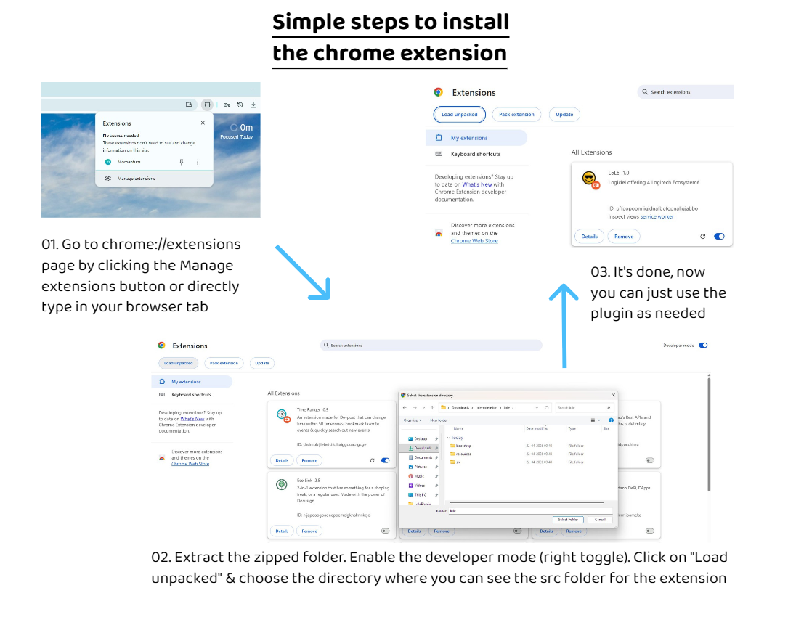
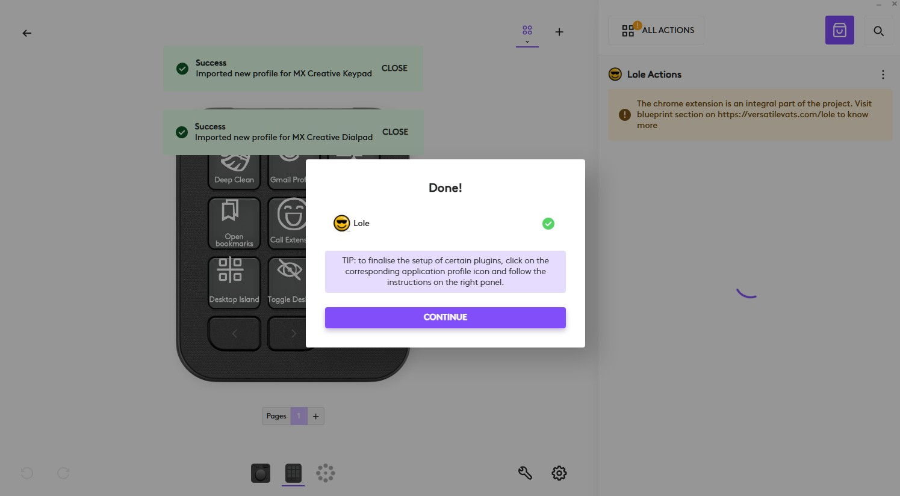
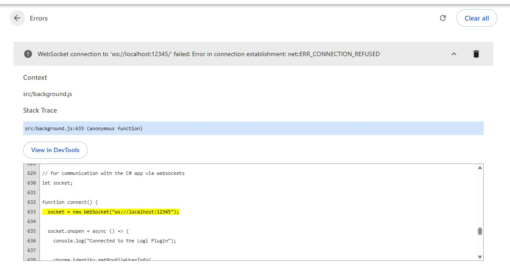

## Project Name: LoLé (Logiciel offering 4 logitech écosystème)

LoLé is a powerful productivity bridge that seamlessly connects your physical Logitech hardware (Creative Console) directly to your digital browser workflows. By functioning as a universal, profile-aware Chrome extension, 
it eliminates context switching and allows you to execute complex OS-level tasks and browser automations with a single physical input.

 

## Installation Guide

I have uploaded the required files on my server. Just click on the following links to dowload the files & use the project on your local machine: 
<a href="https://hackathonmaverick.in/Lole.lplug4">Plugin installation file (.lplug4)</a>   &     <a href="https://hackathonmaverick.in/lole-extension.zip">Extension zipped file</a>

The lplug4 file is ready to be used, as it will install the plugin on your options+ app, but as of now the Chrome extension is <b>not published</b> on the Chrome Web Store, as it takes around
1-week for approval. I have sent the extension for approval to the Google team, and the extension will be available to the users by the next week. Till then, you have to follow the below steps
to successfully load the extension in your Chrome browser:

<ol>
  <li>Extract the extension's zipped file</li>
  <li>Open chrome://extensions page & enable the developer mode (toggle switch)</li>
  <li>Click on load unpacked (top-left button) & select the extension folder (make sure to select the directory of extension which has <b>src folder</b></li>
</ol>

> These are the simple 3-steps which allow you to have the extension on your chrome browser, and use the project to the fullest. Note that, these steps are there as the extension is not yet published. 
Once its published on the webstore, then user will get this installed in a click.

## 

Both, the plugin & extension, will show warning to the users that you are missing another part of the project, in case, both of the components are not installed.

 

