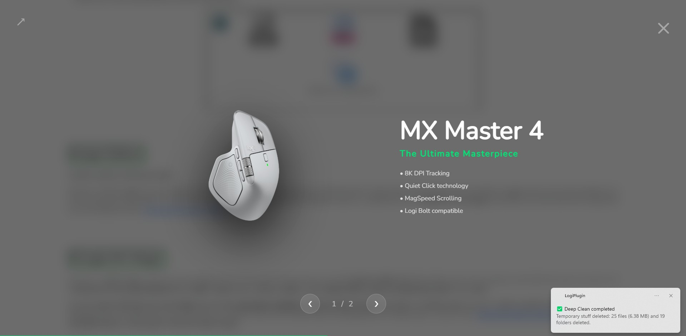
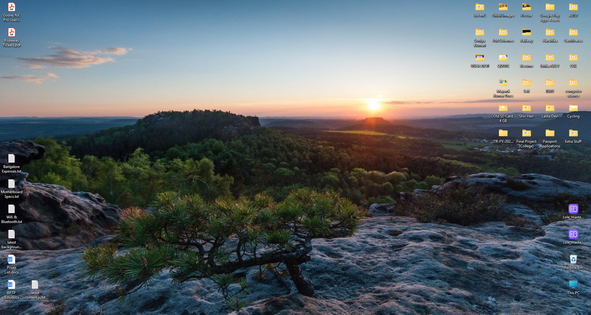
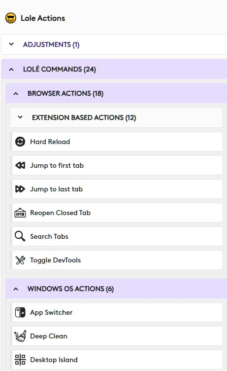

## Project Name: LoLé (Logiciel offering 4 logitech écosystème)

LoLé is a powerful productivity bridge that seamlessly connects your physical Logitech hardware (Creative Console) directly to your digital browser workflows. By functioning as a universal, profile-aware Chrome extension, 
it eliminates context switching and allows you to execute complex OS-level tasks and browser automations with a single physical input.

 

## Table of Contents
* [Installation Guide](#installation-guide)
* [C# code breakdown](#code-breakdown)
* [Learning about some unique actions](#some-clever-tricks)
* [Plugin actions overview](#final-breakdown-of-the-plugin)

 

## Installation Guide

I have uploaded the required files on my server. Just click on the following links to dowload the files & use the project on your local machine: 
<a href="https://hackathonmaverick.in/Lole.lplug4">Plugin installation file (.lplug4)</a>   &     <a href="https://hackathonmaverick.in/lole-extension.zip">Extension zipped file</a>

The lplug4 file is ready to be used, as it will install the plugin on your options+ app, but as of now the Chrome extension is <b>not published</b> on the Chrome Web Store, as it takes around
1-week for approval. I have sent the extension for approval to the Google team, and the extension will be available to the users by the next week. Till then, you have to follow the below steps
to successfully load the extension in your Chrome browser:

<ol>
  <li>Extract the extension's zipped file</li>
  <li>Open chrome://extensions page & enable the developer mode (toggle switch)</li>
  <li>Click on load unpacked (top-left button) & select the extension folder (make sure to select the directory of extension which has <b>src folder</b></li>
</ol>

> These are the simple 3-steps which allow you to have the extension on your chrome browser, and use the project to the fullest. Note that, these steps are there as the extension is not yet published. 
Once its published on the webstore, then user will get this installed in a click.

## 

Both, the plugin & extension, will show warning to the users that you are missing another part of the project, in case, both of the components are not installed.

 

 

## Code Breakdown

1. <a href="Lole%20plugin/src/Actions/CounterCommand.cs">CounterCommand.cs</a>: It features the LoLeBaseCommand abstract class, which implements a "Focus-First" logic. Before any web action runs, it checks if Chrome is active; if not, it automatically launches the correct Chrome profile before sending the command. Contains <b>24 custom actions</b> like DeepCleanCommand, RenameLogiCommand, and ToggleDesktopCommand   
2. <a href="Lole%20plugin/src/Actions/CounterAdjustment.cs">CounterAdjustment.cs</a>: Tailored for efficient context switching. We implemented logic to handle "Tab Swiping" and volume adjustments using asynchronous calls to ensure the hardware dial remains responsive without UI lag. Contains only a single action titled "Switch Chrome Tabs"   
3. <a href="Lole%20plugin/src/DesktopIconManagerAPI.cs">DesktopIconManagerAPI.cs</a>: It targets the <code>SHELLDLL_DefView</code> and <code>WorkerW layers</code> to find the hidden desktop list handle. This allows the "Icon Island" feature—automatically arranging or restoring your desktop icon layout with a single hardware tap.   
4. <a href="Lole%20plugin/src/LolePlugin.cs">LolePlugin.cs</a>: We built a dynamic asset delivery system here. Upon loading, it checks for the existence of .lp5 keypad/dialpad profiles and downloads them from our server only if missing. It also manages the persistent "TargetChromeProfile" setting   
5. <a href="Lole%20plugin/src/NotificationHelper.cs">NotificationHelper.cs</a>: We developed a specialized PowerShell-based XML injector. It can generate standard 2-line alerts or modern, interactive notifications featuring an "Open Location" button that uses protocol activation (file:///) to launch Windows Explorer directly to a specific folder.   
6. <a href="Lole%20plugin/src/WebService.cs">WebService.cs</a>: This is the most critical file. It facilitates bidirectional, real-time communication between the hardware plugin and your Chrome extension. It includes specialized sub-APIs:
  <ul>
    <li>SystemCleanerAPI: Executes deep-clean logic to free up disk space</li>
    <li>ChromeAccountAPI: Reads Chrome Preferences files to identify synced Google profiles</li>
    <li>ChromeWindowManagerAPI: Uses WMI filters to find and focus specific Chrome profile instances natively</li>
  </ul>

 

## Some clever tricks

We loved working with the C# SDK, because having control over an Operating system, relly gives you wiinngss ✈️ & expands the possibilities for you as a developer, which is clearly reflecting in our project.

<h3>1) Automatic profile activation for our universal-plugin</h3>

For the first-time users, the load method of the plugin downloads the profile for keypad and the console, from our server, and saves it in the USER_DIRECTORY. After downloading them, we open/run the  .lp5 files using <code>System.Diagnostics.Process</code>, which actually works perfetcly for the end-user, as he gets the profile as soon as the plugin is installs, easing out his life to manually drag-and-drop or select from the 25-available actions

   

<h3>2) Renaming the logiPluginTool</h3>

When we started working with the Logitech plugin CLI tool, we were excited to see how does it actually helps us in our plugin development journey. But after a while, the need to write <code>LogiPluginTool</code> before the start of every CLI command became quite boring and felt unnecessary. So, we coded a method which allows us to change the name of the exe, so that insead of writing <code>LogiPluginTook</code>, you can do <code>logi</code>, followed by any CLI command you want to execute. This feature is actually a toggle, which allows the end-user to switch between the default LogiPluginTool or logi.

  

<h3>3) Deep Clean thing</h3>

Right from our college days, we are aware of the fact that barely few computer users know that there are some temporary files which sits on your computer over time, and make it slow. We are specifically talking about the temporary and recent file(s) in the Windows OS. One just have to type "temp", "%temp%", "recent" in Windows run to open the particalar directories, and then have tomanually delete those.
  
<code>Path.Combine(Environment.GetFolderPath(Environment.SpecialFolder.UserProfile), "Recent")
Path.Combine(Environment.GetEnvironmentVariable("windir") ?? "C:\\Windows", "Temp")
Path.Combine(Environment.GetFolderPath(Environment.SpecialFolder.LocalApplicationData), "Temp")</code>
  With our plugin action, one can just tap a keypad button, and the rest will be taken care of. This way of deletion removes the need of emptying the recycling bin again, as the temp & recent files are completely removed from your system. Btw, we do not include the feature of "emptying the recycle bin" in the same method, because sometimes, there are certain things which user may want to recover, after mistakenly deleting them. 

  

<h3>4) Desktop Island</h3>

We hate to see the scattered, messy desktop screens of many users, making no-sense. Folders, files, other icons are all-over-the-desktop, making it looking very clumsy. With our plugin, we are providing you a one-tap-action which turns your computer from a messy one into a <b>Desktop Island.</b>

We had a lot of other orientations in our mind, but as it was our first-time using the Windows API by the help of C#, we could finalize only this orientation/segregation

  

<h3>5) Gmail Profiles</h3>

If you are a Windows user, and have Chrome installed on your machine, you might be aware of the fact that if we have multiple emails logged in a single Chrome profile, then accessing those emails is very cumbersome. We have to open the gmail inbox of an email by navigating to mail.google.com/mail/u/0 and from there on, we have to use the dropdown filter, to navigate to other emails. Even to access things like Google account, drive or any other section for the particular gmail account, we have to first dig that hole, which is quite repetitive and boring. 

 

## Final breakdown of the plugin

